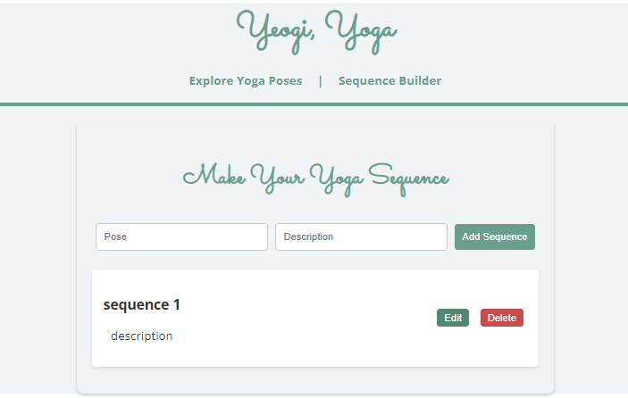

# Yoga Sequence Builder

## Introduction
Yoga Sequence Builder is a web application designed to allow users to create, view, update, and delete yoga sequences. This project serves as a submission for the Mid-term Project assignment. It's built using FastAPI for the backend and React for the frontend, providing a simple yet intuitive interface for managing yoga sequences.

## Project Objectives
- To create a virtual environment for Python projects.
- To set up FastAPI projects and create CRUD API endpoints.
- To connect the front end with the back end using HTTP calls.
- To demonstrate the ability to develop a full-stack web application.

## Getting Started

### Prerequisites
- Python 3.8+
- Node.js 12+
- A modern web browser

### Setting Up the Backend
1. Clone the repository to your local machine.
2. Navigate to the project directory and create a virtual environment: python -m venv venv
3. Activate the virtual environment:
- On Windows: `venv\Scripts\activate`
- On macOS/Linux: `source venv/bin/activate`
4. Install the required dependencies: pip install -r requirements.txt
5. Start the FastAPI server: uvicorn main:app --reload
6. Swagger UI: http://127.0.0.1:8000/docs#/Todo/get_todos_api_todos_get
7. api: http://127.0.0.1:8000/api/todos
8. ReDoc: http://127.0.0.1:8000/redoc#operation/welcome__get

### Setting Up the Frontend
1. Navigate to the frontend directory within the project.
2. Install the necessary Node.js dependencies: npm install
3. Start the React development server: npm start

## Usage
- The application can be accessed at `http://localhost:3000` for the frontend.
- The backend API documentation is available at `http://127.0.0.1:8000/docs`.
- Users can add, view, update, and delete yoga sequences through the web interface.

## Features
- **CRUD Operations**: Full Create, Read, Update, Delete functionality for yoga sequences.
- **Responsive Design**: A user-friendly interface that works on both desktop and mobile browsers.
- **API Documentation**: Auto-generated documentation for all backend endpoints.

## Project Structure
- `/backend`: Contains all backend-related files, including FastAPI app and models.
- `/frontend`: Contains React app components, styles, and scripts for the frontend interface.
- `requirements.txt`: Lists all Python dependencies for the backend.
- `package.json`: Lists all Node.js dependencies for the frontend.

## Screenshots

## Challenges and Solutions

### State Management in React
**Challenge**: Managing the state of todos across different components was initially challenging, leading to inconsistencies in the UI.
**Solution**: Implemented context API and hooks to streamline state management, ensuring that the UI remains consistent across all components.

### Integrating FastAPI with React
**Challenge**: Ensuring seamless communication between the FastAPI backend and the React frontend, especially handling CORS issues and HTTP requests.
**Solution**: Configured CORS middleware in the FastAPI app to allow requests from the frontend domain and used async/await in React to handle API requests gracefully.

### Data Validation and Error Handling
**Challenge**: Providing instant feedback for input validation and errors to improve user experience.
**Solution**: Leveraged Pydantic models for backend validation and implemented custom validation functions in React that display error messages next to the form fields.
## Future Enhancements

1. **User Authentication**: Implement user registration, login, and authentication to personalize yoga sequences and allow users to save their sequences.
2. **Sharing Capabilities**: Add functionality for users to share their yoga sequences with others or on social media platforms.
3. **Advanced Sequence Customization**: Introduce more customizable options for each yoga pose, including duration, difficulty level, and optional notes.
4. **Mobile App**: Develop a mobile version of the application to provide users with access to their sequences on-the-go.
5. **Community Features**: Create a platform for users to share, rate, and comment on each other's sequences, fostering a community of yoga enthusiasts.
